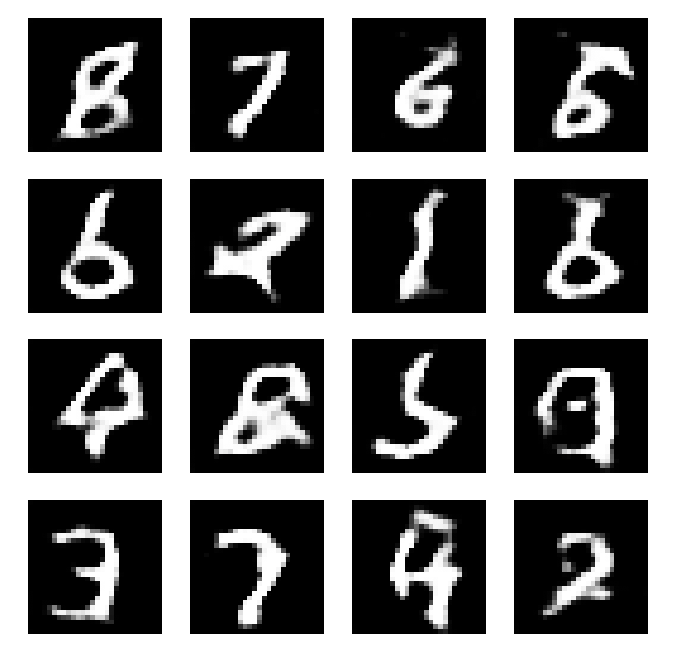

# PyTorch MNIST GAN Example

This example demonstrates how to build a simple GAN on the MNIST dataset using
Determined's Tensorflow Keras API. This example is adapted from this [Tensorflow Tutorial](https://www.tensorflow.org/tutorials/generative/dcgan).
The DCGAN Keras model featured in this example subclasses `tf.keras.Model` and defines
a custom `train_step()` and `test_step()`. This functionality was first added in Tensorflow 2.2.

## Files
* **dc_gan.py**: The code code defining the model.
* **data.py**: The data loading and preparation code for the model.
* **determined_model_def.py**: Organizes the model into Determined's Tensorflow Keras API.
* **export.py**: Exports a trained checkpoint and uses it to generate images.


### Configuration Files
* **const.yaml**: Train the model with constant hyperparameter values.
* **distributed.yaml**: Same as const.yaml, but instead uses multiple GPUs (distributed training).

## To Run
Installation instructions can be found under `docs/install-admin.html` or at [Determined installation page](https://docs.determined.ai/latest/index.html).
After configuring the settings in `const.yaml`, run the following command: `det -m <master host:port> experiment create -f const.yaml . `

## To Export
Once the model has been, its top checkpoint(s) can be exported and used for inference by running:
```bash
python export.py --experiment-id <experimend_id> --master-url <master:port>
```

